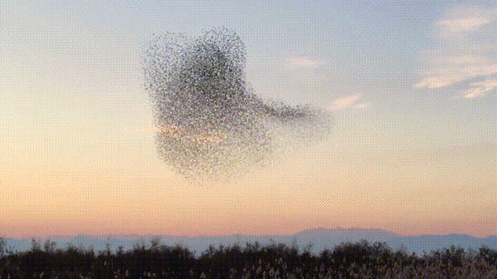

# About Us ⭐️
We are a highly-motivated small team of three collage friends with great passion for technology and design. With each one of us having big dreams and a wholesome heart, there is nothing we cannot do. Our close friendship and ever-improving skills is what makes us unique.

# About ASRO 💻
Smart Swarm Robots (Akıllı Sürü Robotları), aka ASRO, is a project that aims to create highly efficient swarm control of drones using complex algorithms and artificial intelligence. We provide both an interface using the ASRO Web Application and a back end system to control the swarm and the individual agents.

### What is swarm?
Swarming is a behaviour found in nature, like flock of birds or bees living in a hive. This behaviour looks complex from the outside but it is fairly simple from the perspective of an individual inside the swarm. We call these individuals *agents*. To give a better example, image a flock of birds. Each bird is called an agent, and the whole flock is called a swarm.

All agents follow three simple rules. When they are combined, the swarming behaviour starts to show up.
* Stay close to the swarm. (Formation)
* Do not get close to other agents. (Avoidance)
* Go in the direction of the swarm. (Trajectory)

Each can be tweaked and modified to achive a more controlled and efficient swarm fo agents. For example, we can 'control' the direction of the swarm to make them go in a certain direction.